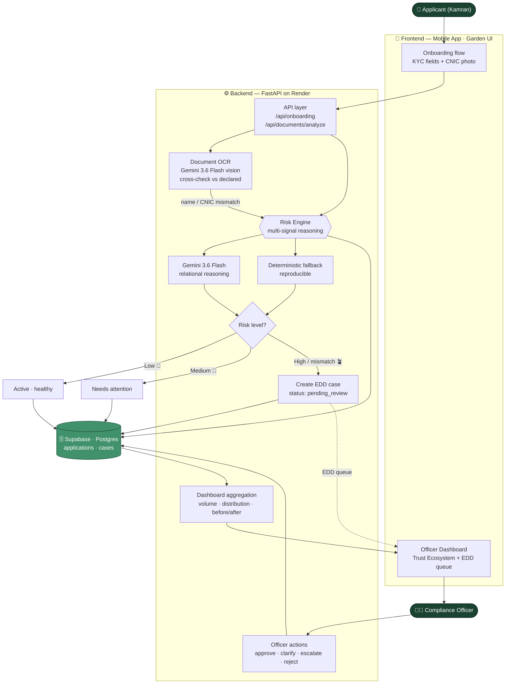

<div align="center">

# 🌱 TrustLens — حق دار کی پہچان

### AI-Driven Customer Risk Profiling for Digital Onboarding

*See risk clearly — instantly, consistently, and with a reason behind every judgment — so digital banking stays both fast and safe for the millions of Pakistanis coming online for the first time.*


**AI Seekho Builders Day Hackathon 2026** · GDG Islamabad × NIC Islamabad
**Track 2 — Fintech (Sponsored by Mobilink)**

</div>

---

## 🎯 The Problem

At a Mobilink Bank agent point in Liaquat Bazaar, a young shopkeeper opens a digital wallet to start receiving customer payments. Meanwhile a compliance officer in Islamabad reviews **hundreds of onboarding applications a day** — each with dozens of fields — judging mostly from gut feeling which are routine and which need a closer look.

Most applicants are genuine. But hidden among thousands of routine applications are a few that carry real risk: mismatched information, unusual patterns, or profiles that just don't add up. **Catching those without slowing down or unfairly flagging honest customers is the entire challenge of financial inclusion at scale.**

## 💡 Our Solution

TrustLens is an AI system that **reasons across multiple onboarding signals *together*** — not one field at a time — to build a dynamic risk profile, flag genuinely high-risk customers for Enhanced Due Diligence, and **explain exactly why** each decision was made.

It's not a form-validation tool. The AI weighs signals in context, produces a risk judgment *with reasoning*, and triggers a **real downstream action** — routing flagged cases to a compliance officer, not just showing a score.

### 🌿 The Garden — making trust visible

Instead of a cold percentage bar, onboarding is a **growing plant**. As the applicant completes each stage, the plant grows. When the AI finds something that doesn't fit, it *needs attention*. When the officer resolves it, it **blooms**. For the officer, hundreds of applications become a **Trust Ecosystem** — a garden where each plant is an application's live compliance state.

> The garden represents the *state of the application*, never a judgment of the person. Uncertainty means "needs attention," not "bad."

---

## ✨ Key Features

| # | Capability | How TrustLens delivers it |
|---|------------|---------------------------|
| 1 | **Capture** | Multi-step KYC onboarding (identity, address, employment, income, purpose, expected volume) + CNIC photo upload |
| 2 | **Dynamic risk profile** | AI cross-references signal *pairs* — income vs transactions, employment vs income, purpose vs volume — never in isolation |
| 3 | **Flag & explain** | Low / Medium / High with a **per-signal reasoning trail** and plain-language conclusion — never a silent score |
| 4 | **Decide & act** | High risk (or identity mismatch) **auto-creates an EDD case** routed to the officer queue |
| 5 | **Officer decision** | Review full reasoning, then approve / request clarification / escalate / reject — human-in-the-loop |
| 6 | **Visualize** | Dashboard: onboarding volume, risk distribution, EDD queue, and case status *before vs after* review |

### 🧠 The reasoning that wins

The core insight is **relational**, not rule-based. Consider two applicants with an *identical* 14× income-to-transaction ratio:

- **Kamran** — self-employed electronics shop, "receive customer payments." A business legitimately processes revenue far above personal income → **Medium**, "worth confirming," one clarification.
- **A student** — no income, "personal use." The same ratio has nothing to explain it → **High**, straight to EDD.

A naive `if income < X` rule flags both identically. TrustLens tells them apart — *that* is multi-signal reasoning.

### 🪪 Document OCR + identity cross-check

Upload a CNIC photo and Gemini 3.6 Flash vision extracts the fields, then **cross-checks them against the declared details**. A name or CNIC mismatch is a textbook identity red flag → a *Document verification* signal is added to the risk trail and the application auto-routes to EDD.

---

## 🏗️ Architecture



---

## 🧰 Tech Stack

**Mobile app** — Expo · React Native 0.81 · React 19 · expo-router · TypeScript · Reanimated + react-native-svg (garden animations) · lucide-react-native
**AI Studio app** — Google AI Studio (server-side Gemini) native Android build
**Backend** — FastAPI · Pydantic v2 · Uvicorn
**AI** — Google Gemini 3.6 Flash (text reasoning + multimodal document OCR)
**Database** — Supabase (Postgres) with an automatic in-memory fallback
**Hosting** — Render (backend) · APK (mobile)

## 📁 Repository Structure

```
trustlens/
├── mobile-app/          # Expo / React Native app  → mobile-first APK
├── trustlens/           # Google AI Studio Android app
└── trustlens-backend/   # FastAPI · Gemini · Supabase  (this service)
```

---

## 🔌 API Reference

Base URL: `https://<your-app>.onrender.com`

| Method | Endpoint | Purpose |
|--------|----------|---------|
| `POST` | `/api/onboarding` | Submit KYC profile → risk assessment (+ EDD case if flagged) |
| `POST` | `/api/documents/analyze` | Upload CNIC/doc image → OCR extract + cross-check vs declared |
| `GET`  | `/api/applications` | Officer list / garden grid |
| `GET`  | `/api/applications/{id}` | Full detail + reasoning trail + case |
| `POST` | `/api/applications/{id}/route-edd` | Officer pulls a medium case into EDD |
| `POST` | `/api/applications/{id}/clarify` | Applicant sends clarification |
| `GET`  | `/api/edd/queue` | Pending EDD cases |
| `POST` | `/api/cases/{id}/action` | approve / request_clarification / escalate / reject |
| `GET`  | `/api/dashboard` | Volume · risk distribution · EDD queue · before/after |

<details>
<summary><b>Example — POST /api/onboarding</b></summary>

```json
// request
{ "name": "Kamran Ahmed", "city": "Rawalpindi", "employment_type": "Self-employed",
  "business_type": "Electronics shop", "monthly_income": 70000,
  "account_purpose": "Receive customer payments", "expected_monthly_transactions": 1000000 }

// response
{ "application_id": "app_xxx",
  "risk": { "level": "medium", "confidence": 84,
    "signals": [ { "label": "Income vs expected transactions", "value": "~14x declared income",
                   "verdict": "attention", "note": "…business receiving customer payments…" } ],
    "conclusion": "…", "engine": "gemini" },
  "status": "needs_attention", "plant_state": "needs_attention", "case_id": null }
```
</details>

**`plant_state` legend:** `healthy` 🌳 · `needs_attention` 🌾 · `under_review` 🪴 · `review_requested` 🌿 · `bloomed` 🌸 · `declined`

---

## 🚀 Getting Started

### Backend
```bash
cd trustlens-backend
pip install -r requirements.txt
cp .env.example .env          # add GEMINI_API_KEY, SUPABASE_URL, SUPABASE_KEY
uvicorn main:app --reload --port 8000
# docs at http://localhost:8000/docs
```
Set `DEMO_MODE=true` for a reproducible deterministic engine (recommended for the demo video); `false` for live Gemini reasoning. On boot it seeds 8 realistic applicants so the dashboard is populated immediately.

### Mobile app
```bash
cd mobile-app
npm install
npx expo start          # scan the QR with Expo Go
# build APK: eas build -p android
```
Point the app's API base URL at your deployed Render backend.

### Supabase
Run `trustlens-backend/supabase_schema.sql` once in the Supabase SQL Editor to create the `applications` and `cases` tables.

---

## 🎬 Demo Personas (reproducible in `DEMO_MODE`)

| Profile | Result |
|---------|--------|
| Salaried, income ≈ transactions | **LOW** → 🌳 healthy |
| Self-employed shop, tx ≫ income, customer payments | **MEDIUM** → 🌾 needs attention |
| Student/unemployed, tx ≫ income, personal use | **HIGH** → 🪴 auto-EDD |
| Any applicant + CNIC whose name/CNIC doesn't match | **Identity mismatch** → 🪴 auto-EDD |

## 👥 Team OffByAnA

| Member | Role |
|--------|------|
| **Muhammad Areeb** | Frontend · Mobile (Expo / React Native) |
| **Areeba Khan** | AI Architect · Backend (FastAPI · Gemini · Supabase) |

## 📄 License

Released under the MIT License. Built for the AI Seekho Builders Day Hackathon 2026.

<div align="center">

*#AISeekhoBuildersDay2026 · #GDG · #NIC · #IndependenceDayHackathon*

</div>
